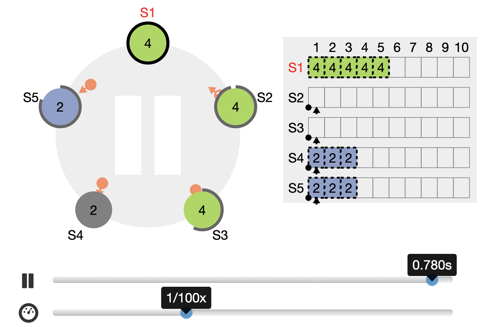
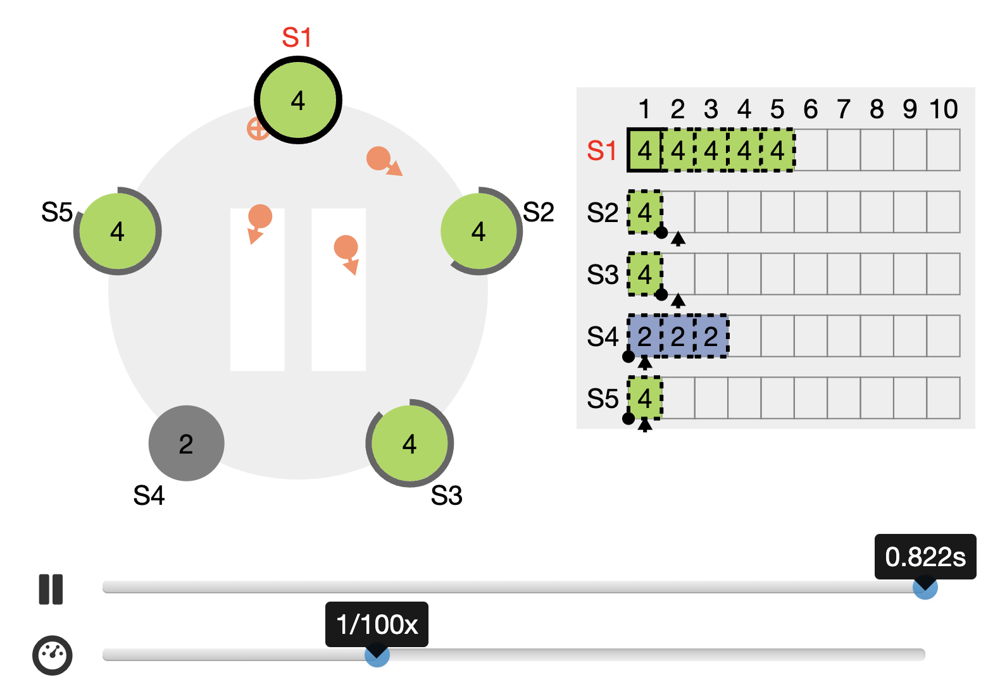
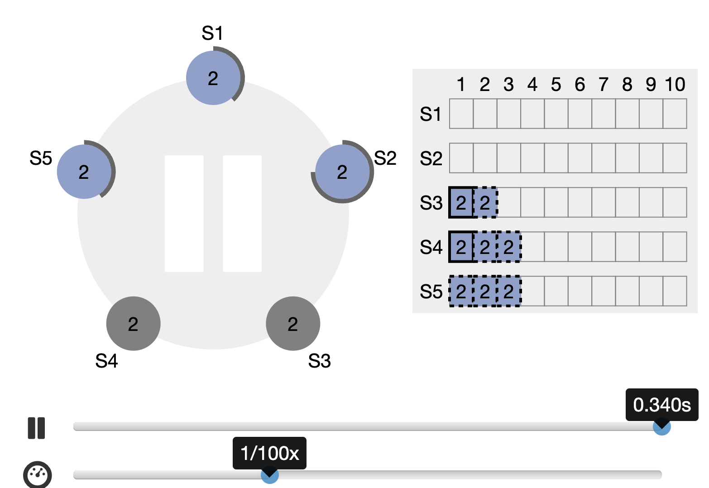
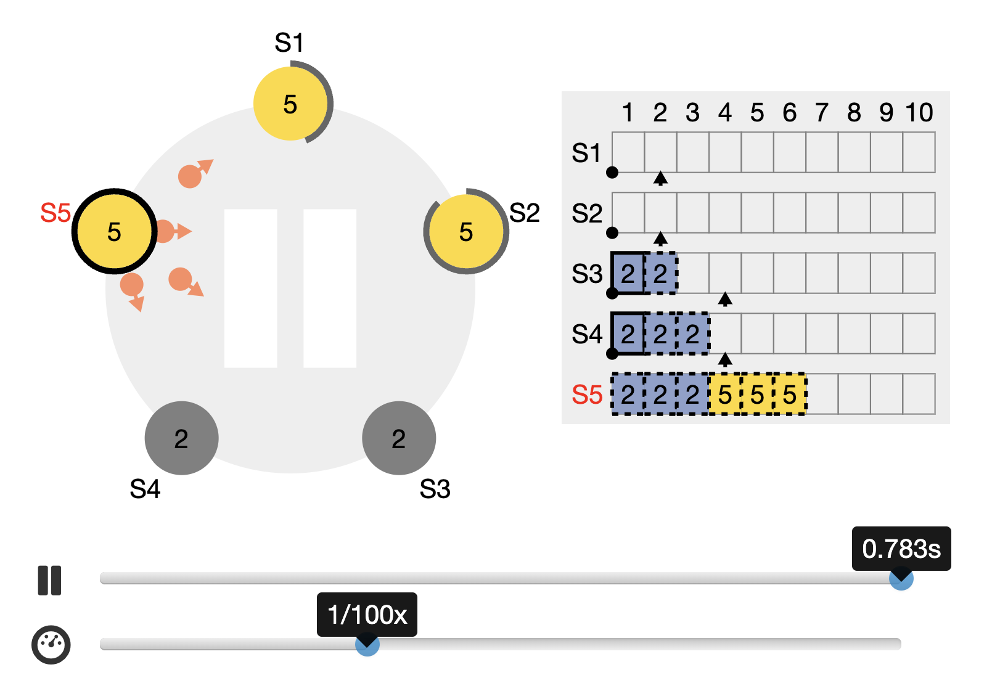
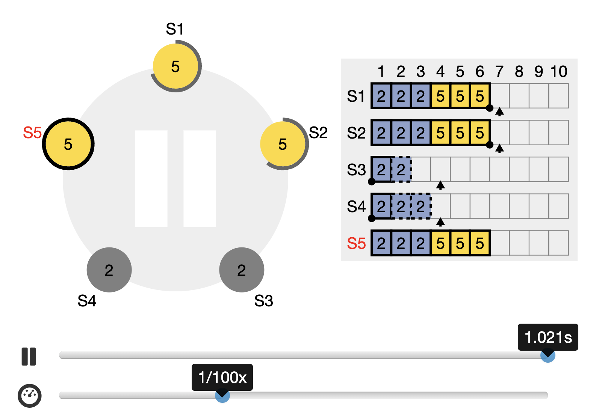

## Raft FAQ

##### 1. Raft为什么要持久化current term？

如果不持久化当前任期，可能会导致以下问题：

1.  **失去一致性**：在 Raft 中，领导者（leader）通过不断地发送心跳消息来维持其在任期内的领导地位。如果不持久化当前任期，那么当系统重新启动或领导者崩溃时，系统可能无法知道当前的任期，从而可能导致多个节点都认为自己是领导者，导致分区，从而破坏了一致性。
2.  **领导者选举问题**：Raft 中的领导者选举是基于任期号的。如果不持久化当前任期，系统可能无法正确地执行领导者选举过程，导致选举过程出现问题，从而无法正常地选举出新的领导者。
3.  **日志一致性问题**：Raft 中的日志复制依赖于当前任期的信息。如果不持久化当前任期，系统可能无法正确地执行日志复制过程，导致日志不一致，从而影响系统的正确性和可靠性。

##### 2. 什么时候需要删除Log？

假设5个节点，$S_1$，$S_2$，$S_3$，$S_4$，$S_5$。

$T_1$时刻通过选举，假设$S_4$获得Leader的身份。**当前任期是2**。

$T_2$时刻$S_1$，$S_2$，$S_3$宕机，$S_4$发起AppendEntry请求，将日志添加到$S_5$上。假设发送了3次AppendEntry请求。

| peer  | next index | match index |
| ----- | ---------- | ----------- |
| $S_1$ | 1          | 0           |
| $S_2$ | 1          | 0           |
| $S_3$ | 1          | 0           |
| $S_5$ | 4          | 3           |

$T_3$时刻$S_1$，$S_2$，$S_3$重启，$S_4$和$S_5$宕机。假设经过两轮超时选举，  $S_1$成为leader，**当前任期是是4**。

$T_4$时刻$S_1$发送AppendEntry请求。

###### 发送前

###### 发送后

可以看到$S_5$删除了之前的Log。

如果在**任期2的时候**，$S_4$服务器成功的将日志复制到一半以上的服务器上，这种情况就不会发生。

###### 情况2

###### 当前任期5

#### 参考

1.  https://raft.github.io/

2.  [Multi-raft](https://tikv.org/deep-dive/scalability/multi-raft/)

3.  [Multi-Raft](https://elasticell.readthedocs.io/en/latest/architecture/multi-raft/)

4.  [MIT 6.824: Lecture 12 - Distributed Transactions](https://timilearning.com/posts/mit-6.824/lecture-12-distributed-transactions/)

    Two Phase Commit和Raft

